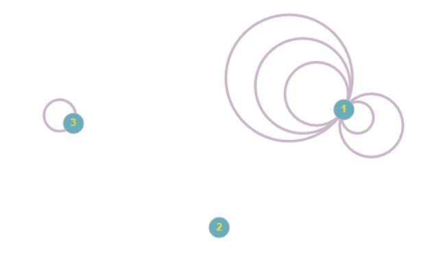
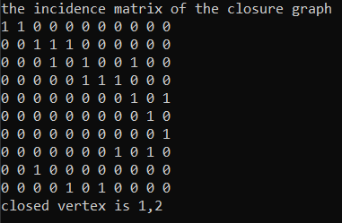
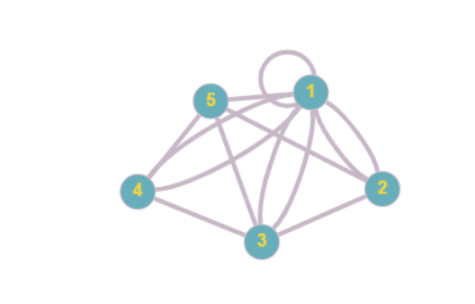

# 
## Расчётная работа №1
Вариант 4.15, способ выражения-матрица инцидентности.
Постановка задачи: найти граф замыкания неориентированного графа.

### Цель:
Получить базовые знания о графе и представлении графа в памяти компьютера, научиться работать с графами.  

### Определения:
- **Граф** - это топологичекая модель, которая состоит из множества вершин и множества соединяющих их рёбер. При этом значение имеет только сам факт, какая вершина с какой соединена.
- **Вершина** - точка в графе, отдельный объект, для топологической модели графа не имеет значения координата вершины, её расположение, цвет, вкус, размер; однако при решении некоторых задачах вершины могут раскрашиваться в разные цвета или сохранять числовые значения.
- **Ребро** - неупорядоченная пара двух вершин, которые связаны друг с другом. Эти вершины называются концевыми точками или концами ребра. При этом важен сам факт наличия связи, каким именно образом осуществляется эта связь и по какой дороге - не имеет значения.
- **Петля** - это ребро инцидентное одной и той же вершине. То есть вершина которая соединена сама с собой.
- **Смежность вершин** - две вершины называются смежными, если они инцидентны одному ребру.
- **Замыкание или отождествление** - Говорят, что пара вершин vi и vj в графе G замыкается (или отождествляется), если они заменяются такой новой вершиной, что все ребра в графе G, инцидентные vi и vj, становятся инцидентными новой вершине.
- **Граф замыкания** - граф, полученный в результате замыкания(отождествления) данного графа.
- **Неориентированный граф** - граф , в котором ребра не имеют направлений.
- **Матрица инцидентности** — одна из форм представления графа, в которой указываются связи между инцидентными элементами графа (ребро(дуга) и вершина). Столбцы матрицы соответствуют ребрам, строки — вершинам.

### Описание алгоритма
1) На вход программе подается файл, содержащий матрицу инцидентности, ее размер, номера 2-х вершин, которые будут замыкаться(если в графе больше 1 вершины).
2) Формируется массив, в хотором хранится данная матрица инцидентности.
3) Определяем, можем ли мы совершить замыкание(количество вершин должно быть больше 1). 
4) С помощью циклов замыкаем две вершины. 
5) Вносим в файл матрицу инцидентности графа замыкания для данного графа.

### Тестирование 
В первых пяти тестах количество вершин в графе было больше 1.   
- **Тест-1**  
**Входной граф:**    
    
**Выходные данные:**    
   
  

- **Тест-2**  
**Входной граф:**    
    
**Выходные данные:**  
   
  

- **Тест-3**  
**Входной граф:**    
    
**Выходные данные:**   
    
   

- **Тест-4**  
**Входной граф:**    
    
**Выходные данные:**   
    
   

- **Тест-5**  
**Входной граф:**      
    
**Выходные данные:**  
    
   

В 6) тесте в графе одна вершина.  
- **Тест-6**  
**Входной граф:**      
    
**Выходные данные:**    
   
.png)  

### Выводы:
Расчётная работа познакомила меня с понятием графа и некоторыми ему прилегающими понятиями, его представлением в памяти компьютера. Также мне удалось углубить своё пониманиe языка программирования C++. 

### Список использованных источников:
- Habr.com Теория графов. Термины и определения в картинках https://habr.com/ru/company/otus/blog/568026/
- Habr.com Способы хранения графа в памяти компьютера: https://habr.com/ru/company/otus/blog/675730/
- Habr.com Теория Графов. Часть 2 Смежность, инцидентность, петли https://habr.com/ru/post/565998/
- Электронный учебно-методический комплекс по дисциплине дискретная математика Для студентов специальности 1-40 03 01 Искусственный интеллект https://studfile.net/preview/1399243/
- Основы С++ программирование для начинающих: https://www.youtube.com/playlist?list=PLQOaTSbfxUtCrKs0nicOg2npJQYSPGO9r