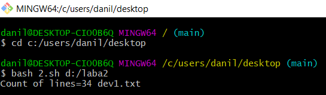
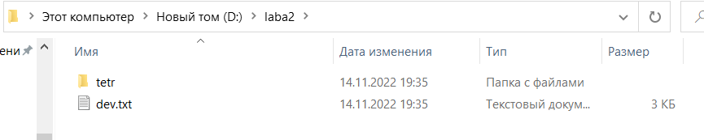
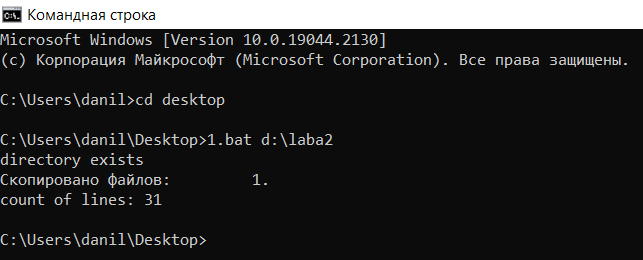
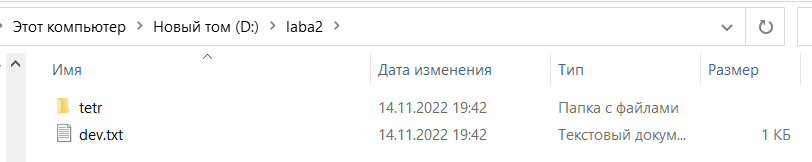

# Лабораторная работа №1
  
---
  
 #### *Условие*: 
  Создать файл sh и bat, который выполняет следующее: Создает файл dev.txt, заносит в него настройки сети. Далее создает папку, копирует туда файл dev, переименовывает его на dev1, выводит в консоль количество строк в файле
#### _Описание_: 
На вход пакетному файлу приходит абсолютный путь к папке (как параметр пакетного файла). 
#### *Примечание*:    
помимо основной задачи, выполнил проверку наличия папки.
#### *Примеры запуска скриптов*:
+ #### sh:

+ #### bat:

 