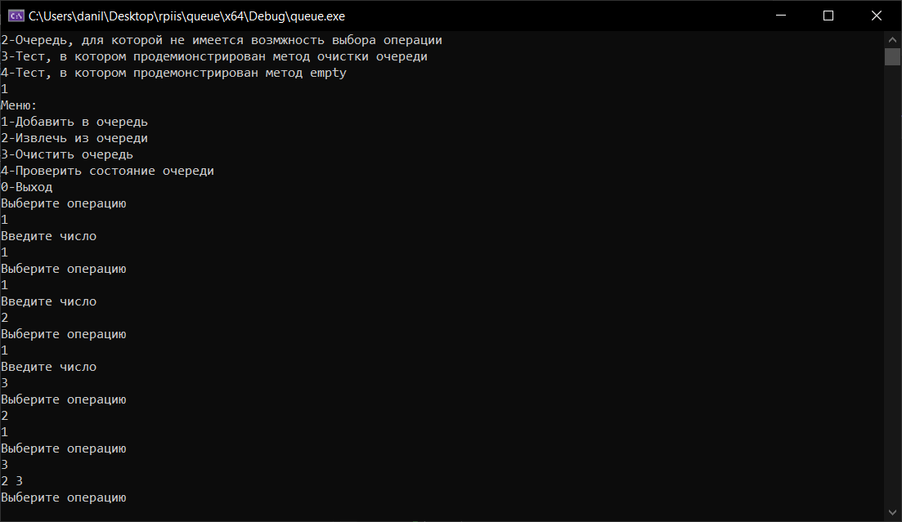
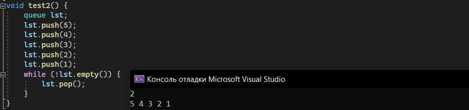
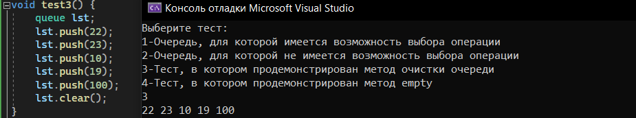
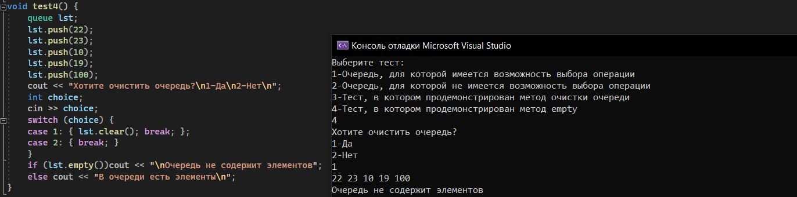

# 
## Лабораторная работа №1
Вариант: 22
Постановка задачи: Очередь. Вставка элемента в очередь. Взятие элемента из очереди.
### Цель:
Исследовать свойства структур данных и разработать библиотеку алгоритмов обработки структур данных 
### Определения:
- **Линейный список** - это конечная последовательность однотипных элементов (узлов), возможно, с повторениями. 
- **Очередь** – линейный список, в котором извлечение данных происходит из начала, а добавление – в конец, т.е. это структура, организованная по принципу FIFO (First In, First Out) – первым вошел, первым выйдет. 
### Реализованные методы:
- **push** - добавление элемента в очередь.
- **pop** - извлечение элемента в очередь.
- **clear** - удаление всех элементов в очереди.
- **empty** - проверка на наличие элементов в очереди(в случае отсутствия элементов возвращает true).
- **queue** - конструктор очереди.
- **~queue** - деструктор для удаления очереди.
- **Node** - конструктор узла.
### Алгоритм
- Каждый элемент очереди содержит указатель на следующий элемент(pNext) и число(data).
- При работе с очередью используют два указателя – на первый элемент (начало – begin) и на последний (конец – end).
- **Формирование очереди** состоит из двух этапов: создание первого элемента и добавление нового элемента в конец очереди.
- При **создании первого элемента** указателям end и begin присваивается его адрес, а указателю pNext данного элемента присваивается nullptr, счетчик элементов увеличивается на 1.
- При **добавлении элемента** указателю end присваивается адрес этого элемента, а указатель begin все также содержит адрес **первого элемента**, для того, чтобы создать связь между элементами, указателю pNext данного элемента присваивается nullptr, а указателю pNext прошлого элемента присваивается адресс нового добавленного элемента, счетчик элементов увеличивается на 1. 
- При **удалении элемента** указателю begin присваивается адрес следующего элемента(), указатель end своего значения не меняет, счетчик уменьшается на 1, элемент удаляется(особый случай: если счетчик равен 0, то удаления не происходит).
- При **удалении всей очереди** выполняется метод pop тех пор, пока счетчик элементов не станет равным 0.
- При **проверке на наличие элементов** в очереди проверяется значение счетчика(0-true, больше 0-false).
### Тестирование 
- **Тест-1**  
Пользователь имеет возможность выполнить функции, введя числа 1-5, которым соответсвуют функции.  
    

- **Тест-2**  
 Тест, в котором выполняется добавление нескольких элементов в очередь, а затем их извлечение до тех пор, пока очередь не станет пустой(проверяется функционал методов push, pop, empty).  
    

- **Тест-3**  
 Тест, в котором выполняется добавление нескольких элементов в очередь, а затем очистка очереди(проверка функционала методов push, clear).  
    

- **Тест-4**  
 Тест, в котором проверяется наличие элементов в очереди(проверка функционала метода clear)  
    

### Выводы:
В ходе выполнения лабораторной работы я ознакомился с динамической структурой хранения данных "Очередь" и реализовал данную структуру, в многофайловом проеекте с использованием классов.
### Источники информации:
- https://codelessons.ru/cplusplus/ochered-queue-v-c-realizaciya-i-chto-eto-voobshhe-takoe.html
- https://www.youtube.com/playlist?list=PLQOaTSbfxUtBm7DxblJZShqBQnBAVzlXX
